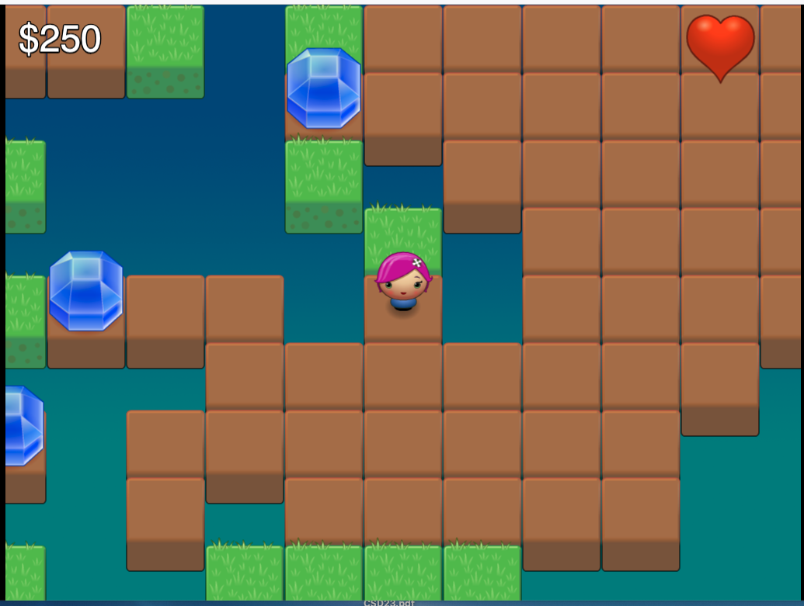

Magic Dollar Seeds
===

This is the game of Magic Dollar Seeds. It was originally published in the magazine "Spectrum Computing Oct/Nov 1982", pp89-90,  but the name of the author is not given.

The orginal was in ZX81 BASIC; this is a version written for the web using [Phaser.io](https://phaser.io/) and  graphics from [Planet Cute](https://lostgarden.com/2007/05/12/dancs-miraculously-flexible-game-prototyping-tiles/)

The original instructions read:

----

In this game, you are trying to 
escape the computer, which
behaves in a fairly intelligent way
to try and trap you. As you move
around the screen, you leave a 
trail of seeds. Moving back onto a 
seed causes four dollar signs to 
appear around you. Moving onto a
dollar sign adds $10 onto your 
score. You move by pressing the 
5, 6, 7 or 8 keys, moving in the
direction of the arrows on those
keys.

The snag in all this is that each
time you move, the computer digs
two holes (inverse letter O) to trap
you. If you become totally enclosed
by Os, you are dead. However, 
you have one let out. If you've
managed to accumulate $40 or 
more, you can press the 9 key,
and four dollar signs will appear
around you, so the game can continue.
However, your tally will be 
diminished by $40, so the game can continue 
for some time.

---- 

You can find it online; it's only about 42 lines of code. It is accompanied by a curious image of a jet fighter pilot flying through a sky filled with kidney beans. 

The 'fairly intelligent' comment is a lie; it just places the holes randomly. The 'continue for some time' part is all too true.

In this version, you move by clicking the square to move to. If you get stuck and can afford the $40, click the heart icon in the top right.
Everything else in the game play is the same.